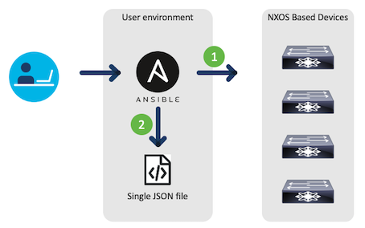
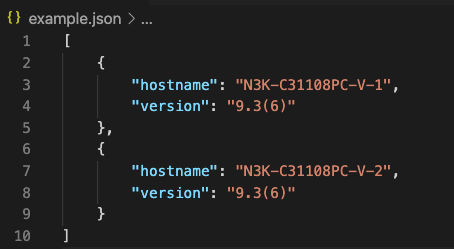

# ansible_nsox_example
This repository is a very simple example for getting data from NSOX devices using ansible.



<br><br>
# Prerequisite
- ansible collection: cisco.nxos

<br><br>
# How to run
```
ansible-playbook -i hosts main.yml
```
As a result, Json file will be created like below.

