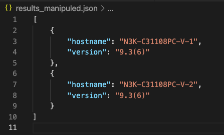
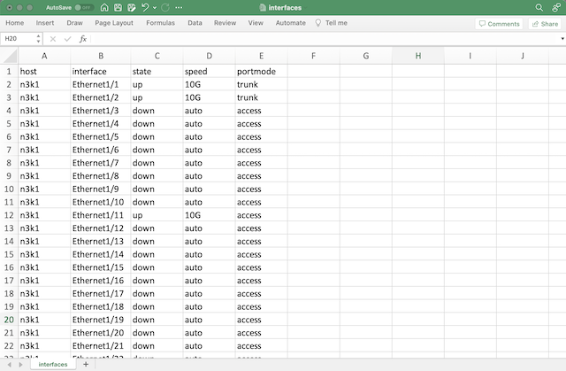

# Ansible NXOS Example
A very simple examples for collecting data from Cisco Nexus devices using ansible.


<br><br>
# Prerequisite
- ansible collection: cisco.nxos

<br><br>
# How to run
1. Edit inventory file
    ```
    [nexus]
    n3k1 ansible_host=CHANGE_ME ansible_user=CHANGE_ME ansible_password=CHANGE_ME
    n3k2 ansible_host=CHANGE_ME ansible_user=CHANGE_ME ansible_password=CHANGE_ME

    [nexus:vars]
    ansible_connection=ansible.netcommon.network_cli
    ansible_network_os=cisco.nxos.nxos
    ```

2. Run playbook
    ```
    ansible-playbook -i hosts version.yml
    ansible-playbook -i hosts interface.yml

    ```

3. As a result, 2 files are created.

    - version.json

    

    - interfaces.csv
    
    

<br>

# References
- [Cisco Nexus 9000 Series NX-OS Command Reference](https://www.cisco.com/c/en/us/td/docs/switches/datacenter/nexus9000/sw/7-x/command_references/configuration_commands/b_Using_N9K_Config_Commands/b_N9K_Bookmap_preface_011000.html)
